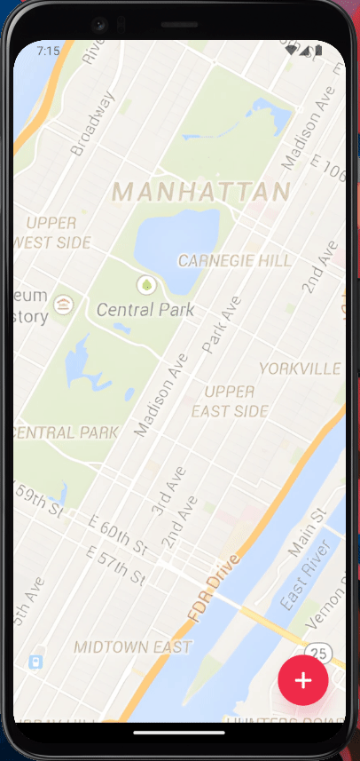

# React-Native-Fab-Button

<h2 align="center">
  A simple animated floating action button screen Built with React Native, Expo and Reanimated.
</h2>

<p align="center">
  
  
  
  
  <a href="https://github.com/areasflavio/react-native-fab-button/commits/master">
    
  </a>
</p>

<p align="center">
  <a href="#star-features">Features</a>&nbsp;&nbsp;|&nbsp;&nbsp;
  <a href="#keyboard-technologies">Technologies</a>&nbsp;&nbsp;|&nbsp;&nbsp;
  <a href="#computer_mouse-installation">Installation</a>
</p>

<p align="center">
  
</p>

<br/>

# :star: Features

[(Back to top)](#React-Native-Fab-Button)

Some key features are:

- Customizable buttons
- Smooth animations

The application is built using React Native with Expo framework.
The entire codebase is written using Typescript.

<br/>

# :keyboard: Technologies

[(Back to top)](#React-Native-Fab-Button)

This is what I used and learned with this project:

- [x] React Native
- [x] Expo
- [x] Reanimated
- [x] Typescript

<br/>

# :computer_mouse: Installation

[(Back to top)](#React-Native-Fab-Button)

To use this project, first you need NodeJS installed in your device,
then you can follow the commands below:

```bash
# Clone this repository
git clone https://github.com/areasflavio/react-native-fab-button.git

# Go into the repository
cd react-native-fab-button

# Install dependencies for the application
yarn install

# To start the development server, run the following command
npm run start

# You start the emulator following the terminal instructions or:
npm run android # for android emulator

npm run ios # for ios emulator
```

# :man_technologist: Author

[(Back to top)](#React-Native-Fab-Button)

Build by Flávio Arêas 👋 [Get in touch!](https://www.linkedin.com/in/areasflavio/)
